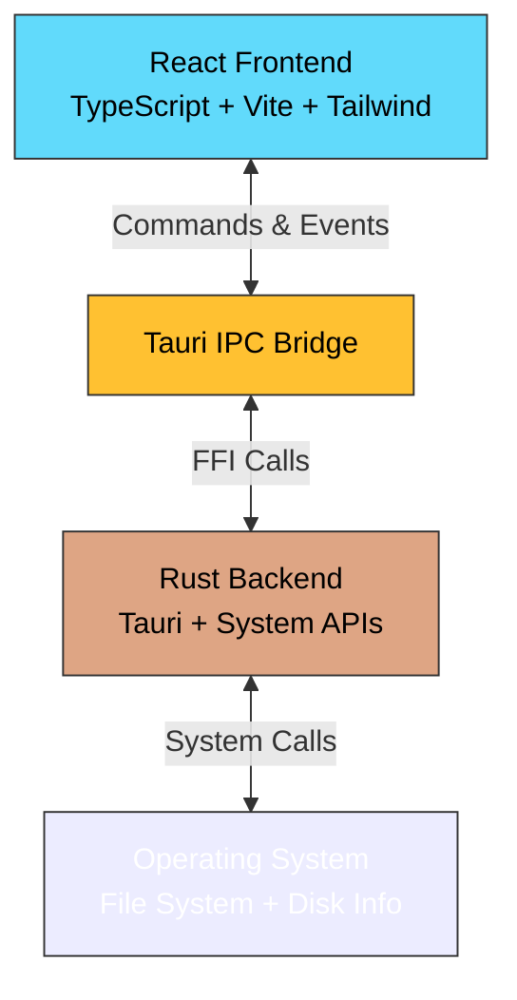

# Architecture

SquirrelDisk is built using a modern, cross-platform architecture that combines the performance of Rust with the flexibility of React. This page provides an overview of how the application is structured and how data flows through the system.

## High-Level Architecture

SquirrelDisk uses the **Tauri framework**, which creates a bridge between a Rust backend and a web-based frontend:



**Key Benefits:**
- Native performance for disk scanning (Rust)
- Rich, interactive UI (React + D3.js)
- Small bundle size (~10MB installer)
- Cross-platform support (Windows, macOS, Linux)

## Technology Stack

<Tabs>
  <Tab title="Frontend">
    ### React + Vite + TypeScript
    
    The frontend is a single-page application built with modern web technologies:
    
    | Technology | Purpose | Version |
    |------------|---------|----------|
    | **React** | UI framework | 18.2.0 |
    | **TypeScript** | Type safety | 4.6.4 |
    | **Vite** | Build tool & dev server | 4.0.0 |
    | **Tailwind CSS** | Styling framework | 3.2.4 |
    | **D3.js** | Sunburst chart visualization | 7.8.2 |
    | **React Router** | Client-side routing | 6.8.0 |
    | **react-beautiful-dnd** | Drag-and-drop functionality | 13.1.1 |
    
    **Key Libraries:**
    - `@tauri-apps/api` - Communication with Rust backend
    - `pretty-bytes` - Human-readable file sizes
    - `vscode-icons-js` - File type icons
    - `shade-blend-color` - Color manipulation for chart
  </Tab>
  
  <Tab title="Backend">
    ### Rust + Tauri
    
    The backend handles system operations and performance-critical tasks:
    
    | Crate | Purpose | Version |
    |-------|---------|----------|
    | **tauri** | Framework core | 1.2 |
    | **sysinfo** | System information (disks, memory) | 0.27.7 |
    | **parallel-disk-usage** | Fast disk space calculation | 0.8.3 |
    | **walkdir** | Directory traversal | 2 |
    | **serde/serde_json** | Serialization | 1.0 |
    | **window-vibrancy** | Frosted glass effect | 0.3.2 |
    | **window-shadows** | Native window shadows | (custom fork) |
    | **regex** | Pattern matching | 1 |
    
    **Platform-Specific:**
    - `windows-sys` - Windows API access
    - `cocoa` + `objc` - macOS API access
  </Tab>
</Tabs>

## Core Components

### Frontend Components

The React frontend is organized into several key components:

<CardGroup cols={2}>
  <Card title="DiskList.tsx" icon="list">
    **Purpose:** Main screen that displays available disks and drives
    
    **Key Features:**
    - Lists all mounted disks using `get_disks` command
    - Shows disk capacity and usage
    - Filters system disks on macOS/Linux
    - Folder picker for custom scans
    - Version display and navigation
    
    **Location:** `src/components/DiskList.tsx`
  </Card>
  
  <Card title="DiskDetail.tsx" icon="chart-pie">
    **Purpose:** Detailed view of a disk with interactive sunburst chart
    
    **Key Features:**
    - Manages scan lifecycle (start/stop)
    - Renders D3.js sunburst visualization
    - Handles chart interactions (click, hover)
    - File/folder deletion via drag-and-drop
    - Real-time scan progress updates
    - Breadcrumb navigation
    
    **Location:** `src/components/DiskDetail.tsx`
  </Card>
  
  <Card title="TitleBar.tsx" icon="window-maximize">
    **Purpose:** Custom window title bar
    
    **Key Features:**
    - Platform-specific window controls
    - Drag region for moving window
    - Minimize/maximize/close buttons
    - Native look and feel
    
    **Location:** `src/components/TitleBar.tsx`
  </Card>
  
  <Card title="FileLine.tsx" icon="file">
    **Purpose:** Individual file/folder item in the list
    
    **Key Features:**
    - Draggable for deletion
    - File type icons
    - Size formatting
    - Right-click context menu
    - "Show in folder" action
    
    **Location:** `src/components/FileLine.tsx`
  </Card>
  
  <Card title="DiskItem.tsx" icon="hard-drive">
    **Purpose:** Individual disk/drive item in the main list
    
    **Key Features:**
    - Displays disk name, mount point, and capacity
    - Shows usage percentage with color-coded progress bar
    - Click to start quick scan (min-ratio: 0.001)
    - Right-click to start full scan (min-ratio: 0)
    - Distinguishes removable drives with special icon
    
    **Location:** `src/components/DiskItem.tsx`
  </Card>
  
  <Card title="ParentFolder.tsx" icon="folder-open">
    **Purpose:** Breadcrumb navigation for current folder in detail view
    
    **Key Features:**
    - Shows current folder path and size
    - Click to navigate to parent folder
    - Right-click to open in file explorer
    - Synchronized with sunburst chart focus
    
    **Location:** `src/components/ParentFolder.tsx`
  </Card>
</CardGroup>

### d3chart.ts - Sunburst Visualization

The core visualization logic is in `src/d3chart.ts`. This module creates the interactive sunburst chart that shows disk space usage:

**Key Functions:**
- `getChart()` - Initializes and returns the D3 chart instance
- `partition()` - Computes hierarchical layout using `d3.partition()`
- `arcVisible()` - Determines which arcs should be visible
- `setTargetAngles()` - Calculates animation targets for zoom
- `animateToTarget()` - Animates transitions between states

**Visualization Features:**
- Hierarchical sunburst layout with up to 4 depth levels
- Color-coded by depth (using `shade-blend-color`)
- Click to zoom into folders
- Hover to see file details
- Smooth animations between states
- Responsive sizing

### Backend Components

<Tabs>
  <Tab title="main.rs">
    ### src-tauri/src/main.rs
    
    The entry point for the Rust backend. Handles Tauri setup and command registration.
    
    **Key Responsibilities:**
    - Initialize Tauri application
    - Apply platform-specific window styling (transparency, shadows, rounded corners)
    - Register Tauri commands
    - Manage global state
    
    **Tauri Commands:**
    ```rust
    #[tauri::command]
    fn get_disks() -> String
    // Returns JSON list of available disks
    
    #[tauri::command]
    fn start_scanning(
        app_handle: tauri::AppHandle,
        state: tauri::State<'_, MyState>,
        path: String,
        ratio: String,
    ) -> Result<(), ()>
    // Starts scanning a disk/directory
    
    #[tauri::command]
    fn stop_scanning(
        app_handle: tauri::AppHandle,
        state: tauri::State<'_, MyState>,
        path: String,
    ) -> Result<(), ()>
    // Stops the current scan
    
    #[tauri::command]
    fn show_in_folder(path: String)
    // Opens the file explorer at the given path
    ```
    
    **State Management:**
    ```rust
    pub struct MyState(Mutex<Option<CommandChild>>);
    ```
    Stores the current scanning process for cancellation.
  </Tab>
  
  <Tab title="scan.rs">
    ### src-tauri/src/scan.rs
    
    Handles disk scanning using the `parallel-disk-usage` crate.
    
    **How Scanning Works:**
    
    1. **Start Scan** (`start()`):
       - Receives path and minimum ratio (for filtering small files)
       - Spawns `pdu` (parallel-disk-usage) as a sidecar process
       - Filters system directories (like `/proc`, `/dev` on Linux)
       - Sets up event listeners for stdout/stderr
    
    2. **Progress Reporting**:
       - Parses progress messages from `pdu` stderr using regex
       - Emits `scan_status` events with items, total bytes, and errors
       - Updates UI in real-time
    
    3. **Completion**:
       - Receives JSON output from `pdu` stdout
       - Emits `scan_completed` event with full directory tree
       - Frontend processes and visualizes the data
    
    4. **Cancellation** (`stop()`):
       - Kills the `pdu` process
       - Cleans up state
    
    **Event Flow:**
    ```
    Frontend          Backend          Sidecar (pdu)
       │                 │                    │
       ├─start_scanning─>│                    │
       │                 ├─spawn────────────>│
       │                 │                    │
       │<─scan_status────┤<─progress─────────┤
       │<─scan_status────┤<─progress─────────┤
       │                 │                    │
       │<─scan_completed─┤<─json output──────┤
    ```
  </Tab>
  
  <Tab title="window_style.rs">
    ### src-tauri/src/window_style.rs
    
    Applies native window styling for a polished look.
    
    **Platform-Specific Features:**
    
    **Windows:**
    - Applies blur effect with `window-vibrancy`
    - Sets rounded corners on Windows 11
    - Configures border color
    - Uses `DwmSetWindowAttribute` from Windows API
    
    **macOS:**
    - Applies vibrancy effect (frosted glass)
    - Uses `NSVisualEffectMaterial::HudWindow`
    - Enables window shadows
    
    **Linux:**
    - Shadows controlled by compositor
    - Uses default GTK styling
    
    This creates SquirrelDisk's distinctive transparent, modern appearance.
  </Tab>
</Tabs>

## Data Flow

Here's how data flows through SquirrelDisk from start to finish:

<Steps>
  <Step title="User Selects Disk">
    User clicks on a disk in `DiskList` component or picks a folder.
    
    Frontend navigates to `DiskDetail` with disk information.
  </Step>
  
  <Step title="Start Scan">
    `DiskDetail` invokes the `start_scanning` Tauri command:
    
    ```typescript
    await invoke("start_scanning", {
      path: disk.mountPoint,
      ratio: "0.01"
    });
    ```
  </Step>
  
  <Step title="Rust Backend Processes Request">
    `main.rs` receives the command and calls `scan::start()`.
    
    `scan.rs` spawns the `pdu` sidecar process with appropriate arguments.
  </Step>
  
  <Step title="Real-Time Progress Updates">
    As `pdu` scans the disk:
    - Progress messages are parsed from stderr
    - Backend emits `scan_status` events to frontend
    - Frontend updates the progress indicator
    
    ```typescript
    await listen("scan_status", (event) => {
      setStatus(event.payload);
    });
    ```
  </Step>
  
  <Step title="Scan Completion">
    When scan finishes:
    - `pdu` outputs JSON to stdout
    - Backend emits `scan_completed` event
    - Frontend receives hierarchical disk data
    
    **Data Structure:**
    ```json
    {
      "name": "/",
      "size": 1234567890,
      "children": [
        {
          "name": "Users",
          "size": 987654321,
          "children": [...]
        },
        ...
      ]
    }
    ```
  </Step>
  
  <Step title="Data Processing">
    Frontend processes the raw data:
    - `pruneData.ts` converts to D3 hierarchy format
    - Filters out files below minimum ratio
    - Builds path mappings for navigation
    - Creates indexed item map
  </Step>
  
  <Step title="Visualization">
    `d3chart.ts` renders the sunburst chart:
    - Uses `d3.partition()` for hierarchical layout
    - Calculates arc positions (angles and radii)
    - Applies color scheme based on depth
    - Enables interactive zooming and hovering
  </Step>
  
  <Step title="User Interaction">
    User can now:
    - Click arcs to zoom into folders
    - Hover to see file details
    - Right-click files to open in explorer
    - Drag files to delete list
    - Navigate breadcrumbs to move up
  </Step>
</Steps>

## Key Dependencies

### Frontend

<AccordionGroup>
  <Accordion title="D3.js - Visualization">
    **Version:** 7.8.2
    
    D3.js powers the sunburst chart visualization. Key D3 modules used:
    - `d3.hierarchy()` - Convert flat data to hierarchy
    - `d3.partition()` - Compute sunburst layout
    - `d3.arc()` - Generate SVG arc paths
    - `d3.select()` - DOM manipulation
    - `d3.transition()` - Smooth animations
    
    The chart supports:
    - 4 levels of depth
    - Click to zoom
    - Hover interactions
    - Breadcrumb navigation
  </Accordion>
  
  <Accordion title="react-beautiful-dnd - Drag and Drop">
    **Version:** 13.1.1
    
    Enables drag-and-drop functionality for marking files for deletion:
    - Drag files from the list
    - Drop into delete zone
    - Visual feedback during drag
    - Batch deletion support
    
    Key components:
    - `DragDropContext` - Wraps the entire drag context
    - `Droppable` - Defines drop zones
    - `Draggable` - Makes items draggable
  </Accordion>
  
  <Accordion title="@tauri-apps/api - IPC Communication">
    **Version:** 1.2.0
    
    Provides the bridge between React and Rust:
    
    **Commands (React → Rust):**
    ```typescript
    import { invoke } from "@tauri-apps/api/tauri";
    
    const disks = await invoke("get_disks");
    await invoke("start_scanning", { path, ratio });
    await invoke("show_in_folder", { path });
    ```
    
    **Events (Rust → React):**
    ```typescript
    import { listen } from "@tauri-apps/api/event";
    
    await listen("scan_status", (event) => {
      console.log(event.payload);
    });
    ```
    
    **Other APIs:**
    - `dialog.open()` - Native file picker
    - `app.getVersion()` - App version info
    - `os.platform()` - Platform detection
    - `fs.removeFile()` - File operations
  </Accordion>
</AccordionGroup>

### Backend

<AccordionGroup>
  <Accordion title="parallel-disk-usage - Fast Scanning">
    **Version:** 0.8.3
    
    High-performance disk space analyzer written in Rust:
    - Multi-threaded scanning
    - Progress reporting
    - JSON output format
    - Configurable minimum ratio (filter small files)
    - Bottom-up traversal
    
    SquirrelDisk runs `pdu` as a sidecar process for maximum performance.
    
    **Why sidecar?**
    - Independent process lifecycle
    - Easy to cancel
    - Isolates crashes
    - Pre-compiled binary
  </Accordion>
  
  <Accordion title="sysinfo - System Information">
    **Version:** 0.27.7
    
    Cross-platform system information library:
    - List mounted disks
    - Total and available space
    - Disk type detection (HDD, SSD, removable)
    - Mount point paths
    - Disk names
    
    Used in the `get_disks` command to populate the disk list.
  </Accordion>
  
  <Accordion title="walkdir - Directory Traversal">
    **Version:** 2
    
    Recursive directory iterator:
    - Fast, memory-efficient
    - Follows symlinks (optional)
    - Error handling
    - Filter support
    
    Used for any custom directory scanning or file operations beyond `pdu`.
  </Accordion>
  
  <Accordion title="window-vibrancy & window-shadows">
    **window-vibrancy:** 0.3.2  
    **window-shadows:** Custom fork
    
    Native window effects:
    - Blur/transparency (Windows, macOS)
    - Rounded corners (Windows 11)
    - Drop shadows (Windows, macOS)
    - Vibrancy materials (macOS)
    
    Creates SquirrelDisk's distinctive translucent, modern UI.
  </Accordion>
</AccordionGroup>

## Platform Differences

SquirrelDisk adapts to each platform:

<Tabs>
  <Tab title="Windows">
    **Window Styling:**
    - Blur effect with semi-transparent background
    - Rounded corners on Windows 11
    - Custom border color
    - Native window shadows
    
    **File Operations:**
    - Uses `explorer /select,` to show files
    - Backslash path separators
    - Drive letters (C:, D:, etc.)
    
    **Scanning:**
    - Scans from drive root (C:\, D:\, etc.)
    - No system directory filtering needed
  </Tab>
  
  <Tab title="macOS">
    **Window Styling:**
    - HudWindow vibrancy effect
    - Native shadows
    - Transparent titlebar
    - Frosted glass appearance
    
    **File Operations:**
    - Uses `open -R` to reveal files
    - Forward slash path separators
    
    **Scanning:**
    - Filters `/System/Volumes/Data` (duplicates)
    - Excludes `/System`, `/Volumes`
    - Handles APFS volumes
  </Tab>
  
  <Tab title="Linux">
    **Window Styling:**
    - Compositor-controlled shadows
    - GTK theme integration
    - Standard decorations
    
    **File Operations:**
    - Uses `xdg-open` to open folders
    - Forward slash path separators
    
    **Scanning:**
    - Filters system mounts: `/proc`, `/dev`, `/sys`, `/mnt`, `/media`
    - Excludes `/var/snap` paths
    - Excludes `/boot/efi`
  </Tab>
</Tabs>

## Performance Considerations

<CardGroup cols={2}>
  <Card title="Fast Scanning" icon="bolt">
    - Multi-threaded Rust backend
    - Parallel directory traversal
    - Minimal ratio filtering (skip small files)
    - Sidecar process isolation
  </Card>
  
  <Card title="Memory Efficiency" icon="memory">
    - Streaming progress updates
    - Pruned data structure
    - Limited chart depth (4 levels)
    - Lazy rendering in D3
  </Card>
  
  <Card title="UI Responsiveness" icon="gauge-high">
    - React state management
    - Vite HMR for development
    - Debounced events
    - Smooth D3 transitions
  </Card>
  
  <Card title="Bundle Size" icon="file-zipper">
    - ~10MB installer
    - Tauri native webview
    - No Electron overhead
    - Tree-shaken dependencies
  </Card>
</CardGroup>

## Testing Strategy

While SquirrelDisk doesn't currently have a comprehensive test suite, here are recommended testing approaches:

<Tabs>
  <Tab title="Manual Testing">
    **Disk Scanning:**
    - Test on different disk types (HDD, SSD, USB)
    - Scan various directory sizes (small, large, massive)
    - Test cancellation mid-scan
    - Verify progress accuracy
    
    **UI Interactions:**
    - Click through chart depths
    - Hover over different arcs
    - Drag and drop files
    - Navigate breadcrumbs
    - Test "show in folder"
    
    **Platform Testing:**
    - Test on Windows 10 and 11
    - Test on macOS (Intel and Apple Silicon)
    - Test on Ubuntu, Fedora, Arch Linux
  </Tab>
  
  <Tab title="Rust Unit Tests">
    Add tests in `src-tauri/src/`:
    
    ```rust
    #[cfg(test)]
    mod tests {
        use super::*;
        
        #[test]
        fn test_disk_filtering() {
            // Test system disk filtering logic
        }
        
        #[test]
        fn test_path_conversion() {
            // Test Windows path conversion
        }
    }
    ```
    
    Run with `cargo test`
  </Tab>
  
  <Tab title="Integration Tests">
    Test the full flow:
    1. Mock disk data
    2. Start scan
    3. Verify events emitted
    4. Check JSON output format
    5. Validate chart rendering
    
    Consider using Tauri's testing utilities:
    - `tauri::test::mock_invoke`
    - `tauri::test::mock_emit`
  </Tab>
</Tabs>

## Future Improvements

The codebase has several areas marked for improvement:

<Warning>
  From the README: "The code is still spaghetti and needs a lot of refactoring."
</Warning>

**Potential Refactoring:**
- Extract shared logic into utilities
- Improve TypeScript type definitions
- Add comprehensive error handling
- Implement proper state management (Redux, Zustand)
- Add unit and integration tests
- Optimize D3 rendering for large datasets
- Improve Rust code organization
- Add logging framework

**Feature Ideas:**
- Multiple disk comparison
- Export reports (CSV, PDF)
- Search functionality
- File filtering by type
- Duplicate file detection
- Historical disk usage tracking

## Resources

<CardGroup cols={2}>
  <Card title="Tauri Docs" icon="book" href="https://tauri.app/v1/guides/">
    Official Tauri framework documentation
  </Card>
  
  <Card title="D3.js Examples" icon="chart-simple" href="https://observablehq.com/@d3/gallery">
    D3.js visualization examples and tutorials
  </Card>
  
  <Card title="parallel-disk-usage" icon="github" href="https://github.com/KSXGitHub/parallel-disk-usage">
    The disk scanning library used by SquirrelDisk
  </Card>
  
  <Card title="Rust Book" icon="book-open" href="https://doc.rust-lang.org/book/">
    Learn Rust programming language
  </Card>
</CardGroup>

## Next Steps

Now that you understand the architecture:

<CardGroup cols={2}>
  <Card title="Start Contributing" icon="code-pull-request" href="/contributing/overview">
    Follow the GitHub workflow to contribute code
  </Card>
  
  <Card title="Browse Issues" icon="list-check" href="https://github.com/adileo/squirreldisk/issues">
    Find an issue to work on
  </Card>
</CardGroup>
